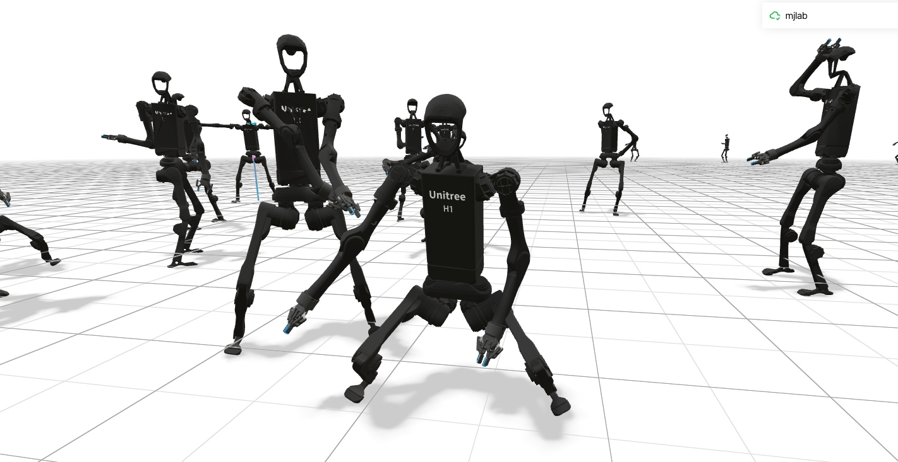

# mjlab-homierl
> Compatible with mjlab v1.0.0's API.

> [!WARNING]
> **This repository is for LEARNING PURPOSES only.**
>
> The current project structure (forking `mjlab` directly) was chosen to facilitate synchronization with upstream changes during development since last October.
>
> However, this is **NOT the recommended structure**.
>
> For standard projects, please adopt the **External Project Structure**.
> **Recommended Codebase Reference:** [mujocolab/anymal_c_velocity](https://github.com/mujocolab/anymal_c_velocity).

https://github.com/user-attachments/assets/3585a46e-f1b9-4c76-8bd6-6d0aaebd8c4b


## What is mjlab?

mjlab ([Zakka, K., Yi, B., Liao, Q., & Le Lay, L. (2025). MJLab: Isaac Lab API, powered by MuJoCo-Warp, for RL and robotics research](https://github.com/mujocolab/mjlab)) combines [Isaac Lab](https://github.com/isaac-sim/IsaacLab)'s proven API
with best-in-class [MuJoCo](https://github.com/google-deepmind/mujoco_warp) physics to provide lightweight, modular abstractions for RL robotics research
and sim-to-real deployment.

---

## Installation

**From source:**

```bash
git clone https://github.com/Nagi-ovo/mjlab-homierl.git
cd mjlab-homierl
```

## Training HOMIE

> [!IMPORTANT]
> This repository aims to reproduce the **lower-body locomotion reinforcement learning** part of the following work using **mjlab**:
> **[HOMIE: Humanoid Loco-Manipulation with Isomorphic Exoskeleton Cockpit](https://arxiv.org/abs/2502.13013)** (arXiv:2502.13013).

> [!NOTE]
> You can also download both locomotion policies from [huggingface](https://huggingface.co/Nagi-ovo/HOMIERL-loco) to skip the training part and start playing :)

### Train (w/o hands)

```bash
uv run train Mjlab-Homie-Unitree-H1 --env.scene.num-envs 4096

uv run train Mjlab-Homie-Unitree-H1 \
  --gpu-ids 0 1 \
  --env.scene.num-envs 4096
```

### Train (with robotiq hands)

```bash
uv run train Mjlab-Homie-Unitree-H1-with_hands --env.scene.num-envs 4096

uv run train Mjlab-Homie-Unitree-H1-with_hands \
  --gpu-ids 0 1 \
  --env.scene.num-envs 4096
```

### Play (w/o hands)

```bash
uv run play Mjlab-Homie-Unitree-H1 --checkpoint-file MODEL_PATH --num-envs 30 --viewer viser
```

### Play (with robotiq hands)

```bash
uv run play Mjlab-Homie-Unitree-H1-with_hands --checkpoint-file homie_rl.pt --num-envs 30 --viewer viser --device cuda:0
```

---

### Sanity-check with Dummy Agents

Use built-in agents to sanity check your MDP **before** training.

```bash
uv run play Mjlab-Your-Task-Id --agent zero  # Sends zero actions.
uv run play Mjlab-Your-Task-Id --agent random  # Sends uniform random actions.
```

---

### ✅ **Implemented Key Contributions**

> [!NOTE]
> **Reference implementation** (for diffing) is vendored in this repo under HOMIE's orignal implementation repo's `legged_gym/` (env/MDP) and `rsl_rl/` (HIMPPO + estimator).
> The **mjlab reimplementation** lives under `src/mjlab/tasks/homie/` (env/MDP) and `src/mjlab/rl/himppo/` + `src/mjlab/tasks/homie/rl/` (algo/runner/export).

#### 0. RL Algorithm + Observation Layout (HIMPPO)
- [x] **HIMPPO (symmetry + estimator)**: Ported into mjlab (`src/mjlab/rl/himppo/`) from the reference `rsl_rl/rsl_rl/`
- [x] **Runner wiring**: HOMIE tasks use `HomieHimOnPolicyRunner` so HIMPPO is the default training loop (see `src/mjlab/tasks/homie/config/h1/__init__.py`, `src/mjlab/tasks/homie/rl/him_runner.py`)
- [x] **Observation layout + history**: One-step layout + actor history=6 / critic history=1 matches the reference (see `src/mjlab/tasks/homie/homie_env_cfg.py`, `src/mjlab/tasks/homie/mdp/observations.py`)
- [x] **H1 adaptation**: Mirror maps + lower-body `act_dim=10` are adapted to Unitree H1 (reference G1 uses `act_dim=12`)

#### 1. Upper-Body Curriculum Learning
- [x] **Progressive upper-body motion disturbances**: Implemented via `UpperBodyPoseAction` that generates smooth, randomized pose targets for torso and arm joints
- [x] **Curriculum ratio scaling**: `upper_body_action_curriculum` gradually increases disturbance amplitude (0→1) based on velocity tracking performance (threshold: 0.8)
- [x] **Smooth interpolation**: Uses lerp with configurable rate (default 0.05) to avoid abrupt pose changes
- [x] **Default pose initialization**: Upper body starts at default positions and progressively adds noise

**Original Implementation Details:**
- Samples new upper-body targets every `upper_interval` control steps (computed from `upper_interval_s`; default `upper_interval_s=1.0s` in the reference HOMIE config)
- Uses exponential distribution for joint ratio: `-1.0 / (20 * (1-ratio*0.99)) * log(1 - u + u * exp(-20 * (1-ratio*0.99)))`
- Target range: `(action_min, action_max) * random_joint_ratio`

**mjlab Implementation:**
- Samples new upper-body goal targets on an interval schedule (2.0s by default; see `src/mjlab/tasks/homie/config/h1/env_cfgs.py`)
- Uses uniform joint deltas from a configurable range (scaled by curriculum ratio and clamped to joint limits; see `src/mjlab/tasks/homie/config/h1/env_cfgs.py`)
- Cleaner separation: policy controls only lower-body (legs), upper-body follows internal targets

#### 2. Multi-Task Framework
- [x] **Three task modes**: Velocity tracking, squatting (height control), and standing
- [x] **Coupled 3-mode command resampling (HOMIE)**: At each resampling instant, sample mutually-exclusive modes: **1/3** squat (height), **1/2** velocity tracking, **1/6** standing; twist+height are coupled via `homie_three_mode` (see `src/mjlab/tasks/homie/mdp/velocity_command.py`)
- [x] **Height tracking reward**: Tracks relative height (pelvis to lowest foot) with configurable target range
- [x] **Task-specific observations**: Height command included in policy observations

**Range Configuration:**
- H1 squat range: 0.40-0.98m (pelvis height relative to the lowest foot site)
- Inactive height for non-squat mode (velocity + standing): 0.98m (standing)

> [!NOTE]
> The reference HOMIE config uses `resampling_time=4.0s` for command updates; mjlab currently uses a fixed 5.0s resampling in `make_homie_env_cfg()`.

#### 3. Reward Shaping
- [x] **Knee deviation penalty**: Penalizes using knees incorrectly during height changes
- [x] **Feet parallel rewards**: Encourages symmetric gait and flat foot contact
- [x] **No-fly + air-time (LeggedGym-style)**: `no_fly` and `feet_air_time` align with the reference single-support and first-contact landing logic
- [x] **Velocity/height tracking**: Dual tracking rewards for locomotion and squatting
- [x] **Posture rewards**: Variable posture constraints (tighter when standing, looser when walking/running)

#### 4. Disturbance Randomization (Random Push + Hand Load)
- [x] **Random push via external wrenches**: Periodic horizontal force pulses applied to the base (`pelvis`) to simulate external disturbances (see `src/mjlab/tasks/homie/config/h1/env_cfgs.py`)
- [x] **Hand load (0–5kg)**: Constant downward force per hand (per-env, sampled once) applied via `xfrc_applied`; uses wrist links when hands are enabled, otherwise elbow links
- [x] **No curriculum**: Push and hand load are active from the start at full range

### ⚠️ **Missing/Different Components**

#### 1. Upper-Body Motion Details
- [ ] **Exponential distribution sampling**: mjlab uses uniform distribution instead of the original's exponential distribution for joint targets

<details>
<summary>Reference implementation (legged_gym)</summary>

> ```python
> # From legged_robot.py line 117-124
> if (self.common_step_counter % self.cfg.domain_rand.upper_interval == 0):
>     # (NOTE) implementation of upper-body curriculum
>     self.random_upper_ratio = min(self.action_curriculum_ratio, 1.0)
>     uu = torch.rand(self.num_envs, self.num_actions - self.num_lower_dof, device=self.device)
>     # Exponential distribution for joint ratio
>     self.random_upper_ratio = -1.0 / (20 * (1-self.random_upper_ratio*0.99))*torch.log(1 - uu + uu * np.exp(-20 * (1-self.random_upper_ratio*0.99)))
>     self.random_joint_ratio = self.random_upper_ratio * torch.rand(self.num_envs, self.num_actions - self.num_lower_dof).to(self.device)
>     rand_pos = torch.rand(self.num_envs, self.num_actions - self.num_lower_dof, device=self.device) - 0.5
>     self.random_upper_actions = ((self.action_min[:, self.num_lower_dof:] * (rand_pos >= 0)) + (self.action_max[:, self.num_lower_dof:] * (rand_pos < 0) ))* self.random_joint_ratio
> ```

</details>


- [ ] **Per-joint curriculum ratio**: Original computes a random ratio per joint; mjlab samples a single ratio per environment (uniform in `[0, max_ratio]`) and applies it across all upper-body joints

<details>
<summary>Reference implementation (legged_gym)</summary>

> ```python
> # From legged_robot.py line 122
> # Each joint gets its own ratio = global_ratio * random_value
> self.random_joint_ratio = self.random_upper_ratio * torch.rand(self.num_envs, self.num_actions - self.num_lower_dof).to(self.device)
> # Shape: [num_envs, num_upper_body_dofs], different ratio per joint
> ```

</details>

- [ ] **Sampling cadence / interpolation**: Reference samples a new goal every `upper_interval` steps (computed from `upper_interval_s`) and integrates `delta_upper_actions` each step; mjlab samples new goals on a 2.0s schedule but interpolates toward them every step via `torch.lerp`

<details>
<summary>Reference implementation (legged_gym)</summary>

> ```python
> # From legged_robot.py line 117-126
> # Updates happen every upper_interval steps (upper_interval = ceil(upper_interval_s / dt))
> if (self.common_step_counter % self.cfg.domain_rand.upper_interval == 0):
>     # Sample new goal targets
>     self.random_upper_actions = ...
>     # Compute delta for smooth interpolation
>     self.delta_upper_actions = (self.random_upper_actions - self.current_upper_actions) / (self.cfg.domain_rand.upper_interval)
> 
> # Every simulation step (line 126):
> self.current_upper_actions += self.delta_upper_actions
> actions = torch.cat((actions, self.current_upper_actions), dim=-1)
> ```

</details>


#### 2. Domain Randomization
- [ ] **Hand payload mass randomization**: Not implemented as *mass* changes in MuJoCo; mjlab-homierl applies an equivalent downward load (0–5kg per hand) via external wrenches instead

<details>
<summary>Reference implementation (legged_gym)</summary>

> ```python
> # From legged_robot.py line 764-765
> if self.cfg.domain_rand.randomize_payload_mass:
>     self.payload = torch_rand_float(self.cfg.domain_rand.payload_mass_range[0], self.cfg.domain_rand.payload_mass_range[1], (self.num_envs, 1), device=self.device)
>     self.hand_payload = torch_rand_float(self.cfg.domain_rand.hand_payload_mass_range[0], self.cfg.domain_rand.hand_payload_mass_range[1], (self.num_envs ,2), device=self.device)
> 
> # Applied in _process_rigid_body_props (line 488-490):
> props[self.torso_body_index].mass = self.default_rigid_body_mass[self.torso_body_index] + self.payload[env_id, 0]
> props[self.left_hand_index].mass = self.default_rigid_body_mass[self.left_hand_index] + self.hand_payload[env_id, 0]
> props[self.right_hand_index].mass = self.default_rigid_body_mass[self.right_hand_index] + self.hand_payload[env_id, 1]
> ```

</details>

- [ ] **Body COM displacement**: Original randomizes torso center-of-mass displacement

<details>
<summary>Reference implementation (legged_gym)</summary>

> ```python
> # From legged_robot.py line 769-770
> if self.cfg.domain_rand.randomize_body_displacement:
>     self.body_displacement = torch_rand_float(self.cfg.domain_rand.body_displacement_range[0], self.cfg.domain_rand.body_displacement_range[1], (self.num_envs, 3), device=self.device)
> 
> # Applied in _process_rigid_body_props (line 494-495):
> if self.cfg.domain_rand.randomize_body_displacement:
>     props[self.torso_body_index].com = self.default_body_com + gymapi.Vec3(self.body_displacement[env_id, 0], self.body_displacement[env_id, 1], self.body_displacement[env_id, 2])
> ```

</details>

- [ ] **Joint injection noise**: Action-level noise injection at torque level

<details>
<summary>Reference implementation (legged_gym)</summary>

> ```python
> # From legged_robot.py line 137-138
> # Randomize Joint Injections every step
> if self.cfg.domain_rand.randomize_joint_injection:
>     self.joint_injection = torch_rand_float(self.cfg.domain_rand.joint_injection_range[0], self.cfg.domain_rand.joint_injection_range[1], (self.num_envs, self.num_dof), device=self.device) * self.torque_limits.unsqueeze(0)
> 
> # Added to torques in _compute_torques (line 552):
> torques = self.p_gains * self.Kp_factors * (self.joint_pos_target - self.dof_pos) - self.d_gains * self.Kd_factors * self.dof_vel
> torques = torques + self.actuation_offset + self.joint_injection
> ```

</details>

- [ ] **Actuation offset**: Per-DOF torque offset randomization

<details>
<summary>Reference implementation (legged_gym)</summary>

> ```python
> # From legged_robot.py line 761-762
> if self.cfg.domain_rand.randomize_actuation_offset:
>     self.actuation_offset = torch_rand_float(self.cfg.domain_rand.actuation_offset_range[0], self.cfg.domain_rand.actuation_offset_range[1], (self.num_envs, self.num_dof), device=self.device) * self.torque_limits.unsqueeze(0)
> 
> # Re-randomized on reset (line 273-274):
> if self.cfg.domain_rand.randomize_actuation_offset:
>     self.actuation_offset[env_ids] = torch_rand_float(self.cfg.domain_rand.actuation_offset_range[0], self.cfg.domain_rand.actuation_offset_range[1], (len(env_ids), self.num_dof), device=self.device) * self.torque_limits.unsqueeze(0)
> ```

</details>

- [ ] **Delay simulation**: Action delay randomization for sim-to-real transfer

<details>
<summary>Reference implementation (legged_gym)</summary>

> ```python
> # From legged_robot.py line 130-134
> self.delayed_actions = self.actions.clone().view(1, self.num_envs, self.num_actions).repeat(self.cfg.control.decimation, 1, 1)
> delay_steps = torch.randint(0, self.cfg.control.decimation, (self.num_envs, 1), device=self.device)
> if self.cfg.domain_rand.delay:
>     for i in range(self.cfg.control.decimation):
>         self.delayed_actions[i] = self.last_actions + (self.actions - self.last_actions) * (i >= delay_steps)
> ```

</details>


#### 3. Control Architecture
- [ ] **Mixed control mode (M)**: Original uses **torque control** for lower-body (legs) and **position control** for upper-body (torso+arms) simultaneously

<details>
<summary>Reference implementation (legged_gym)</summary>

> ```python
> # From legged_robot.py line 558-564
> elif control_type=="M":  # Mixed mode
>     # Compute PD torques for all joints
>     torques = self.p_gains * self.Kp_factors * (
>             self.joint_pos_target - self.dof_pos) - self.d_gains * self.Kd_factors * self.dof_vel
>     
>     torques = torques + self.actuation_offset + self.joint_injection
>     torques = torch.clip(torques, -self.torque_limits, self.torque_limits)
>     # Return: [torques for lower body, position targets for upper body]
>     return torch.cat((torques[..., :self.num_lower_dof], self.joint_pos_target[..., self.num_lower_dof:]), dim=-1)
> 
> # Applied in step() (line 144-146):
> self.torques = self._compute_torques(self.actions).view(self.torques.shape)
> # Send both force and position commands
> self.gym.set_dof_actuation_force_tensor(self.sim, gymtorch.unwrap_tensor(self.torques))
> self.gym.set_dof_position_target_tensor(self.sim, gymtorch.unwrap_tensor(self.torques))
> ```

**Key Differences: Original vs. mjlab Implementation**

**Reference legged_gym (Mixed Control Mode, G1):**
- **Lower-body (legs)**: Policy outputs 12 dimensions → converted to **torque control**
- **Upper-body (torso+arms)**: Randomly generated position targets → **position control**
- Simultaneously sends torque commands and position targets to the simulator

**mjlab Current Implementation (Pure Position Control):**
- **Lower-body (legs)**: Policy outputs 10 dimensions (H1) → converted to position targets → **position control**
- **Upper-body (torso+arms)**: Randomly generated position targets → **position control**
- All joints use position control

**Why Mixed Mode Matters:**
1. **Real-world robots often use Mixed mode**: Torque control for legs to handle ground contact, and position control for the upper body to track poses.
2. **Consistency reduces sim-to-real gap**: Training with the target deployment control mode from the start is critical.
3. **Control Dynamics**: Torque control is more direct but requires the policy to maintain stability; position control is inherently more stable but may lack the necessary compliance or response speed.

**TODO**: For sim-to-real deployment, it is recommended to implement Mixed control mode or verify the performance of pure position control on the physical hardware.

</details>

- [ ] **Random push implementation**: mjlab-homierl implements periodic pushes (4s cadence) but uses MuJoCo external wrenches instead of instantaneous base-velocity impulses

<details>
<summary>Reference implementation (legged_gym)</summary>

> ```python
> # From g1_29dof_config.py line 198
> upper_interval_s = 1  # Update upper-body targets every 1 second
> push_interval_s = 4   # Push robot every 4 seconds
> 
> # Used in legged_robot.py:
> # Line 117: Upper-body updates
> if (self.common_step_counter % self.cfg.domain_rand.upper_interval == 0):
>     # Sample new upper-body targets
> 
> # Line 514: Robot pushing
> if self.cfg.domain_rand.push_robots and (self.common_step_counter % self.cfg.domain_rand.push_interval == 0):
>     self._push_robots()
> ```

</details>

- [ ] **Action delay buffer**: Implements delayed action execution with random delay steps

<details>
<summary>Reference implementation (legged_gym)</summary>

> ```python
> # From legged_robot.py line 130-134
> # Create a buffer for decimation steps
> self.delayed_actions = self.actions.clone().view(1, self.num_envs, self.num_actions).repeat(self.cfg.control.decimation, 1, 1)
> # Random delay: 0 to decimation-1 steps
> delay_steps = torch.randint(0, self.cfg.control.decimation, (self.num_envs, 1), device=self.device)
> if self.cfg.domain_rand.delay:
>     for i in range(self.cfg.control.decimation):
>         # Linearly interpolate from last_action to new action based on delay
>         self.delayed_actions[i] = self.last_actions + (self.actions - self.last_actions) * (i >= delay_steps)
> ```

</details>


#### 4. Observation/State Details
- [x] **IMU angular velocity**: mjlab uses a dedicated IMU ang-vel sensor (`robot/imu_ang_vel`) in the one-step observation
- [ ] **IMU projected gravity**: mjlab currently uses root-link `projected_gravity` (reference uses the IMU link orientation)

<details>
<summary>Reference implementation (legged_gym)</summary>

> ```python
> # From legged_robot.py line 316-317, 336-337
> # Uses IMU link instead of base link for observations
> imu_ang_vel = quat_rotate_inverse(self.rigid_body_states[:, self.imu_index,3:7], self.rigid_body_states[:, self.imu_index,10:13])
> imu_projected_gravity = quat_rotate_inverse(self.rigid_body_states[:, self.imu_index,3:7], self.gravity_vec)
> 
> # Observations include IMU readings (line 318-325):
> current_obs = torch.cat((self.commands[:, :3] * self.commands_scale,
>                         self.commands[:, 4].unsqueeze(1),
>                         imu_ang_vel  * self.obs_scales.ang_vel,
>                         imu_projected_gravity,
>                         (self.dof_pos - self.default_dof_pos) * self.obs_scales.dof_pos,
>                         self.dof_vel * self.obs_scales.dof_vel,
>                         self.actions[:, :12],
>                         ),dim=-1)
> ```

</details>

- [ ] **Joint power tracking**: Tracks 100-step history of joint power consumption

<details>
<summary>Reference implementation (legged_gym)</summary>

> ```python
> # From legged_robot.py line 777
> # Buffer initialization
> self.joint_powers = torch.zeros(self.num_envs, 100, self.num_dof, dtype=torch.float, device=self.device, requires_grad=False)
> 
> # Updated every step (line 191-193):
> joint_power = torch.abs(self.torques * self.dof_vel).unsqueeze(1)
> # Rolling window: shift left and append new power
> self.joint_powers = torch.cat((self.joint_powers[:, 1:], joint_power), dim=1)
> 
> # Reset on episode end (line 258):
> self.joint_powers[env_ids] = 0.
> ```

</details>

---

## Documentation

Full documentation is available at **[mujocolab.github.io/mjlab](https://mujocolab.github.io/mjlab/)**.

---

## Development

Run tests:

```bash
make test          # Run all tests
make test-fast     # Skip slow integration tests
```

Format code:

```bash
uvx pre-commit install
make format
```

Compile documentation locally:

```bash
uv pip install -r docs/requirements.txt
make docs
```

---

## License

mjlab is licensed under the [Apache License, Version 2.0](LICENSE).

---

## Acknowledgments

- **HOMIE**: [HOMIE: Humanoid Loco-Manipulation with Isomorphic Exoskeleton Cockpit](https://arxiv.org/abs/2502.13013).
- **mjlab**: Zakka, K., Yi, B., Liao, Q., & Le Lay, L. (2025). [MJLab: Isaac Lab API, powered by MuJoCo-Warp, for RL and robotics research](https://github.com/mujocolab/mjlab). (Version 0.1.0) [Computer software].
